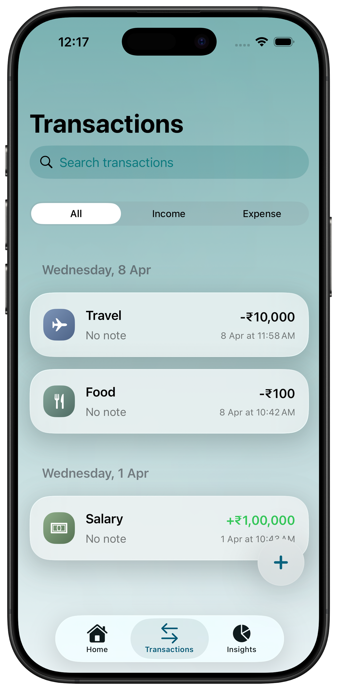
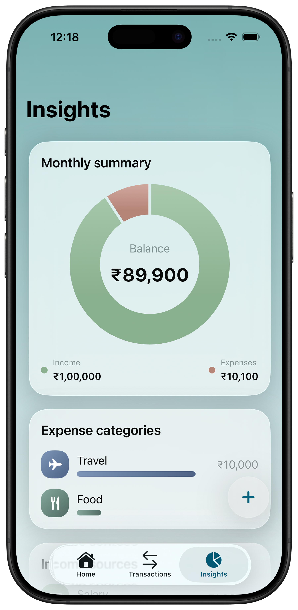

# ExpenseTracker

ExpenseTracker is a premium, Apple-first finance management application built with SwiftUI. It delivers a high-quality experience with liquid glass surfaces, vibrant gradients, and smooth native animations to make tracking your monthly budget feel elegant and effortless.

---

## 📱 Screenshots

| Home | Transactions | Insights | Profile |
| :---: | :---: | :---: | :---: |
|  |  |  |  |

---

## ✨ Features

- **Liquid Glass Design**: A modern fintech aesthetic using `ultraThinMaterial`, custom glassmorphism effects, and sleek gradients.
- **Virtual Tracking Card**: A personalized, draggable, and flippable ATM card that doubles as a quick balance summary.
- **Card Lifecycle Management**: Generate your unique tracking card from your profile or onboarding, and destroy/regenerate it anytime.
- **Search & Filter**: Real-time transaction search with a clean, native search bar integrated below navigation headers.
- **Smart Insights**: Category-based spending breakdowns and monthly snapshot summaries with interactive charts.
- **Profile Management**: Customize your profile with a high-resolution avatar (Camera/Photos) and personal information.
- **Native Experience**: No scroll indicators for a cleaner "app-like" feel, full dark/light mode support, and Apple HIG-compliant interactions.
- **Persistence**: All data is stored locally on-device using JSON persistence for privacy and speed.

---

## 🛠 Setup Instructions

### Prerequisites
- **macOS Sonoma** or later.
- **Xcode 15.0** or later.
- **iOS 17.0+** (Physical device or Simulator).

### Installation
1. **Clone the project** or download the source code.
2. **Open the project**:
   ```bash
   open ExpenseTracker.xcodeproj
   ```
3. **Select a Target**: Choose an iPhone simulator (e.g., iPhone 15 Pro) or your connected physical device.
4. **Build and Run**: Press `⌘ + R` or click the play button in Xcode.

---

## 📂 Project Structure

- **`HomeView.swift`**: The main dashboard featuring the balance card and recent activity.
- **`FinanceStore.swift`**: The centralized engine managing state, persistence, and business logic.
- **`FinanceComponents.swift`**: The UI library containing glass modifiers, stat cards, and the animated ATM card.
- **`TransactionsView.swift`**: Full history management with integrated search.
- **`ProfileView.swift`**: User settings and card management hub.
- **`InsightsView.swift`**: Visual data interpretation and category distribution.

---

Designed with ❤️ for a modern financial life.
